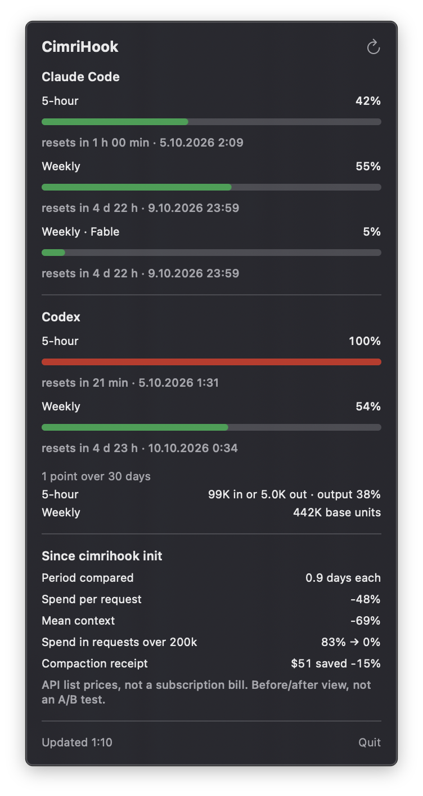

# CimriHook

[](https://github.com/senoldogann/CimriHook/actions/workflows/ci.yml)
[](LICENSE)




> *cimri* (Turkish): miser. CimriHook stops AI coding agents from paying again and again for
> context they no longer need.

Every request an agent makes re-reads the whole conversation from the prompt cache, so a session's
cost grows with the square of its length. In the author's last week of Claude Code use, 98% of the
input tokens were such cache re-reads and 57% of the spend went to requests carrying more than 400k
tokens of context. Shrinking each new tool output (what RTK does) helps with what enters the
context; CimriHook manages how long it stays there, through the agents' own settings and hooks.

| Part | What it does | How |
|---|---|---|
| Measure | where your spend goes and what each compaction window would cost on your own sessions | `cimrihook doctor`, `simulate`, `gain`, also `--agent codex` |
| Govern | sets the compaction window your data calls for, with the agent's own setting | `cimrihook init --compact-window N`, also `--agent codex` |
| Guard | asks once before an idle session re-caches its whole context | `UserPromptSubmit` hook |
| Show | context, prompt-cache warmth, next-request cost and usage limits | status line, macOS menu bar panel |
| Evaluate | A/B runs on your own subscriptions, with honest statistics | `cimrihook bench-run` |

**Measured** (Claude Code with Opus 5.5 and a 1M context, 5 runs per arm,
[details](docs/evaluation.md)): in 20-step bug-fixing sessions that grow to about 450k tokens,
compacting at 150k tokens cut the provider-billed cost by 46% (95% CI 38.9-52.0%) and at 200k by
39% (31.5-45.6%). RTK, measured in the same runs, changed nothing: x1.026 [0.912-1.154] alone,
x0.985 [0.935-1.039] on top of the window. In sessions that peak at 350k, compacting at 150k saved
40% (38-42%) and at 200k 27% (24.5-28.6%). All 900 steps of these runs passed. In shorter sessions
that peak below 125k tokens the effect is small (Claude Code x0.95) or uncertain (Codex x0.80,
interval includes 1).

| 20 bug fixes, sessions up to 450k tokens | Cost | vs baseline [95% CI] | Steps passed |
|---|---|---|---|
| Claude Code as it ships | $13.15 | - | 100/100 |
| + RTK | $13.50 | x1.026 [0.912-1.154] | 100/100 |
| + CimriHook window (`--compact-window 233000`) | $8.03 | x0.610 [0.544-0.685] | 100/100 |
| + CimriHook window (`--compact-window 183000`) | $7.13 | x0.542 [0.480-0.611] | 100/100 |
| + both | $7.91 | x0.602 [0.535-0.676] | 100/100 |

RTK shrinks command output as it enters the context. In these sessions most of the context came
from file reads and the agent's own messages, which stay in the context and are re-read on every
request; CimriHook decides how long they stay. The two work together without conflict.

**In usage-limit terms** (a subscription account, the same 20-step task, five interleaved pairs
without and with the 183000 window, [details](docs/evaluation.md)): the session that costs
$12.95 at list prices takes about 2.3 points of the 5-hour window, the governed one ($7.08)
about 1.2. One point was worth about $4.8 of list-price spend ($4.4-5.2), and nothing suggests
the window counts a dollar of either arm differently (weight ratio 0.97 [0.69-1.36]). It is one
account and one task: it shows that the saving in dollars carries over to the window, not the
exact conversion for your plan; `cimrihook limits` measures that on your own sessions.

`cimrihook doctor` starts with one line about your own last week (the author's, here):

```text
CimriHook doctor (Claude Code, last 7 days): 527 transcripts, 22,688 API requests, $2,631 at API list prices
Bottom line: about $1,049 (39%) was avoidable by compacting above 200.0k (simulated), plus $131 of
re-caching after an hour idle; apply with `cimrihook init --compact-window 233000`
```

The estimate replays your sessions under each window; against the A/B runs above, such replays
have been 0-11 points optimistic.

## Install

```bash
uv tool install git+https://github.com/senoldogann/CimriHook
cimrihook doctor                                # where the spend goes and the window it suggests
cimrihook init --compact-window 233000 --dry-run  # show the change to ~/.claude/settings.json
cimrihook init --compact-window 233000          # guard, status line and the window from doctor
cimrihook gain                                  # an hour or more later: before vs after
cimrihook init --remove                         # take out only what CimriHook added
```

`init` backs the settings file up before writing, keeps the file's permissions, and hides the
values of `env` and `headers` entries in the diff it prints. It is declarative: it first takes
out what an earlier `init` added, then adds the parts you selected now, so re-running it after an
upgrade or a move replaces the old commands instead of adding new ones next to them. A status line
you already have is chained (its command is kept in CimriHook's `--after` argument, which is also
where `--remove` restores it from), and the setting and environment values it replaced are
remembered per settings file in `~/.cimrihook/installed.json`, with the time of the change for
`gain`, so `--remove` can put them back. `cimrihook settings` prints the same blocks for merging
by hand or for a single run: `claude --settings "$(cimrihook settings)"`.

The hook and status line commands run Python with `-I`: they run in your project directory,
outside Claude Code's permission prompts, and without `-I` a `json.py` or `statistics.py` in that
directory would run in CimriHook's place. Everything CimriHook writes under `~/.cimrihook` is
readable by you only. After changing the source of an installed copy, reinstall it with
`uv tool install --force --reinstall --refresh /path/to/your/checkout`: the version number does not
change, so uv would otherwise reuse the old build.

## Measure

```bash
cimrihook doctor --days 7   # where your spend goes and what would change it
cimrihook limits            # what a point of your 5-hour and weekly windows costs (Pro/Max)
cimrihook gain              # the time since your last init vs the same time before it
```

On Pro and Max plans there is no bill: usage fills a 5-hour and a weekly window. Anthropic does
not publish what a cache read, a cache write or an output token counts there, but Claude Code
itself warns that switching model or effort mid-conversation "re-reads everything so far, which
adds to your usage": the windows fill with the same token flows CimriHook prices. With the mod
enabled, every turn records the session's list-price spend and the windows' use, and `limits`
turns that into a rate for your own plan, such as "1 point of the 5-hour window is about $X of
usage" with a 95% interval, read off the spend between one whole-percent step of a window and
the next. Use outside Claude Code (claude.ai chats, other machines) also fills the windows, so
with such use a point looks cheaper than it is.

`gain` compares the time since your last `cimrihook init` that changed your settings with the same
length of time before it: requests, spend at list prices, spend per request, mean context, the
share of spend in requests above 200k tokens, compactions, re-caching after an hour idle and the
prompts the guard stopped. Your work differs between the two periods, so it is a before/after
view, not an A/B test; spend per request and mean context depend least on how much you worked.

`doctor` prices every real request in your Claude Code transcripts at API list prices and splits
the spend by the context size of the request, by token type, by cache rewrites over 100k tokens
and their likely cause (idle past the cache lifetime, compaction, model switch), by main session
and subagents. It also estimates the input-cost share allocated above a historical bare-prefix
baseline using first-request input, which includes initial messages; this is not measured
recoverable savings. With the mod enabled, `doctor` shows active `/context` categories and how
many recorded sessions contain each. It ends
with what would change the largest items; the compaction-window estimate comes from `simulate`
and is labelled as a simulation until an A/B run confirms it.

## Govern the context window

```bash
cimrihook simulate --days 30                   # cost of each compaction policy on your sessions
cimrihook init --compact-window 233000         # sets Claude Code's autoCompactWindow
cimrihook bench-calibrate --name <set>         # simulated vs measured savings of an A/B set
```

`simulate` rebuilds the real request sequence from the usage logs, prices each session with its
own model's cache multipliers and checks the replay against the exact cost recorded there. It then
replays the sequence under each policy. The cost of a compaction comes from the real compactions in
the logs: the summary request reads the context once and writes the summary at the output price,
and the next request carries the new context (system prompt, tools, summary and re-attached
files), of which only the part that is no longer cached is written again. Simulated savings assume
the agent behaves the same otherwise. `bench-calibrate` replays the baseline runs of an A/B set at
the treatment's real trigger point and prints how far the prediction is from the measured ratio.
So far its errors were all on the optimistic side (0 to 11 points), which is why the replay adds
7,000 re-read tokens after every compaction (the median the A/B runs imply); change it with
`--refetch-tokens`. The error is largest when a session later needs much of what the compaction
dropped: then the agent reads it again at every step. Sessions are replayed whole, each Claude session is weighed by its model's
list price (Codex stays in base input units), a forked or resumed session's copied history counts
once, and CimriHook's own A/B runs are left out. Check task quality with an A/B run before
adopting a small window.

Claude Code compacts once the context reaches the window minus 33,000 tokens (a 20,000-token
output reserve and a 13,000-token buffer). `init --compact-window` writes Claude Code's own
`autoCompactWindow` setting (100,000 to 1,000,000, capped at the model's context window), so
compaction cannot start before about 67,000 tokens; `/autocompact` and per-model `modelSettings`
can still override it. A `CLAUDE_CODE_AUTO_COMPACT_WINDOW` environment variable overrides every
setting, so `init` warns when one is set. The A/B harness uses that variable on purpose, so an
arm's window cannot be changed by your settings. `simulate` and `doctor` print the setting for
the window they recommend: the largest one whose simulated cost is within 1 point of the cheapest,
because every compaction trades detail for a smaller context. On the author's last week that is a
200k trigger (-38.1%, 384 compactions) rather than 150k (-38.3%, 707 compactions).

## Pick the cache lifetime

Claude Code writes the prompt cache with a 1-hour lifetime for the main conversation on a
subscription and a 5-minute lifetime with an API key and for subagents. A 1-hour write costs 2x
the input price, a 5-minute write 1.25x, but a pause longer than the lifetime makes the next
request write the whole context again. `doctor` re-prices every request of your last days with
both lifetimes, using your own pauses, and prints both costs per group (main sessions and
subagents) with the replay's own error against your bill. It recommends a switch only when the
other lifetime is cheaper by more than that error and at least 5%:

```bash
cimrihook init --cache-ttl 1h              # promptCacheTtl: main conversation
cimrihook init --subagent-cache-ttl 1h     # subagentPromptCacheTtl
```

On the author's last week a 5-minute main-session cache would have cost 69% more (pauses between
prompts often pass 5 minutes), and a 1-hour subagent cache 2% less, which is within the replay's
error, so both defaults stay. With an API key, where the main conversation gets 5-minute caches,
the same replay is where the saving usually is. `FORCE_PROMPT_CACHING_5M` and
`ENABLE_PROMPT_CACHING_1H` in your env override these settings; `init` warns about them.

## Compact before the cache goes cold (mod)

```bash
cimrihook init --mod        # adds the CimriHook mod to CLAUDE_CODE_PLUGIN_DIRS
```

Claude Code 2.1.286 and later load function-hook plugins ("mods") in the terminal and the desktop
app. CimriHook's mod schedules compaction around the prompt cache instead of only around the
context size:

- **Warm compaction:** when a session on a subscription (1-hour cache) has been idle until five
  minutes before the cache expires and its context is above 100k tokens
  (`CIMRIHOOK_MOD_MIN_TOKENS`), the mod compacts while the cache is still warm. The summary request
  reads the context at the cache-read price, and when you come back the first request writes the
  short summary instead of re-caching the whole conversation. A toast says it happened. The timer
  counts from the last observed cache-using request's start, including response generation time.
  A resumed process waits for a new observed request; response age alone is not a cache deadline.
- **Cold resume:** if the timer could not run (the machine slept), the cold-prompt guard can
  suggest `/compact` once before a large cold request. The mod does not compact inside
  `prompt.submit`: Claude Code refuses that call while the hook holds the incoming turn.
- **Limit meter:** on a subscription, every turn appends the session's list-price spend and the
  use of the 5-hour and weekly windows to `~/.cimrihook/limits/`; `cimrihook limits` turns it into
  what a point of each window costs on your plan.
- **Prefix record:** after a CLI process's first completed turn, the `/context` categories are
  written to `~/.cimrihook/prefix/`. A resumed process updates the same session record.
  `cimrihook doctor` shows each active category's median when present and its session count;
  deferred tools, messages and reserved space are excluded. These snapshots do not measure
  recoverable savings or establish that a category was present on every request.
- **Boundary compaction (experimental, `CIMRIHOOK_MOD_BOUNDARY_TOKENS=N`):** after a completed
  main turn, an interactive session at or above N tokens can compact. Turn completion does not
  establish that a task is finished. No saving or quality improvement has been measured for this
  mechanism. The window remains the backstop inside a turn.
- **Mask-first (experimental, `CIMRIHOOK_MOD_MASK=1`):** an automatic compaction keeps the
  conversation and replaces older tool results with a one-line placeholder instead of asking the
  model for a summary (observation masking, which matched summarisation at lower cost in the
  JetBrains study). It takes milliseconds where Claude Code's summary took 14-63 seconds in the A/B
  runs. The newest tool result stays whole, and older recent ones while they fit in 10% of the
  context. In one `deeper` run it passed every step at $8.85, against $8.03 for the window alone:
  faster compactions, no saving. When masking would not remove at least 40% of the context,
  Claude Code's own summary runs.

`init --mod` writes the plugin to `~/.cimrihook/mod/cimrihook` and adds that folder to
`CLAUDE_CODE_PLUGIN_DIRS` in your settings, keeping folders you already have there; `--remove`
puts the variable back. The mod counts every compaction of the main conversation, so after Claude
Code's own compaction (including idle compaction where a server flag enables it) or a `/compact`
it does not compact again before the next turn. Warm and boundary compaction require an attached
interactive surface. Claude Code 2.1.289 does not support `session.compact()` in `-p`/SDK sessions;
the mod skips those automatic paths there. Native window compaction and explicit `/compact`
commands remain available. `DISABLE_AUTO_COMPACT=1` disables CimriHook's automatic paths;
`DISABLE_COMPACT=1` also disables its manual compaction overrides.

Mask-first hands its messages back rebuilt rather than by the engine's handles: in Claude Code
2.1.288 the handles tie a resumed session to the history before the compaction, so `--resume`
would load the whole conversation again
([anthropics/claude-code#95328](https://github.com/anthropics/claude-code/issues/95328)).
Rebuilt messages lose their thinking blocks and attachments, the first resume after a mask
compaction misses the prompt cache once, and on Opus and Sonnet 5.5 the API may re-think after
earlier tool results change. Use it where compaction pauses hurt more than these costs.

## Guard the cache

When a session sits idle past its prompt-cache lifetime (1 hour on subscriptions, 5 minutes
elsewhere), the next message re-caches the whole conversation. On a 900k-token session that is
one request of about $7 at list prices. The cold-prompt guard (`UserPromptSubmit` hook) stops that
message once, says what it would cost and suggests `/compact`; sending the message again goes
ahead. It only steps in above `CIMRIHOOK_GUARD_MIN_TOKENS` of context, reads the cache lifetime
from the last cache write in the transcript, stays quiet right after a compaction (the context is
small again), and never blocks on its own errors: they exit 1, which Claude Code shows without
stopping the prompt. `cimrihook doctor` ends with a check that the guard can read your newest
session.

A stopped prompt can only be sent again by a person. Claude Code 2.1.288 does not tell hooks
where a prompt came from, so the guard never stops prompts that are clearly not typed by you:
system notifications (`[SYSTEM NOTIFICATION ...]`), tagged messages such as
`<task-notification>`, commands starting with `/` (including `/compact` and `/loop`) and subagent
prompts. A scheduled prompt that arrives as plain text cannot be told apart from yours; if you
deliver such prompts into long idle sessions, switch the guard off with
`CIMRIHOOK_DISABLE=guard`.

## See it live

Add CimriHook's status line to Claude Code (`~/.claude/settings.json`):

```json
"statusLine": {"type": "command", "command": "cimrihook statusline"}
```

`412k ctx · cache warm 38m · next $0.08 · compact pays back in 10 requests · 5h 42% · 7d 18% · $4.12`

It shows the session's context, whether the prompt cache is still warm and for how long, what
the next request costs at list prices (a cache read while warm, the re-cache Claude Code expects
once cold), how many requests a `/compact` now would take to pay for itself (above 150k tokens of
context: the summary request and the re-cached shorter context against the smaller reads that
follow), your 5-hour and 7-day usage limits and the session's spend. Cache warmth, lifetime and
expiry come from Claude Code's own `prompt_cache` input (2.1.251 and later); Claude Code also
re-runs the status line when the cache expires. Every new usage-limit reading is recorded in the
ledger, so CimriHook can learn how your plan counts cache reads, writes and output.

`cimrihook init` keeps a status line you already have: it runs first with the same input, every
line of its output is kept and CimriHook's part ends the last line. If CimriHook's part fails, its
error is shown in the line instead (Claude Code blanks the whole status line on a non-zero exit).

### macOS menu bar panel

`macos/` holds a small SwiftUI menu bar app (macOS 14 or later). The menu bar shows the fullest
window of each provider (`C 39%  X 100%`); its panel shows every 5-hour and weekly window of
Claude Code and Codex with the time left until it resets, what a point of each Codex window cost
over the last 30 days, and the ratios of `cimrihook gain`.

```bash
macos/build-app.sh                      # builds macos/build/CimriHook Bar.app
open "macos/build/CimriHook Bar.app"    # or copy it to /Applications
```

The app holds no measurement of its own: every five minutes, and when you press refresh, it runs
`cimrihook quota --agent claude`, `cimrihook quota --agent codex`,
`cimrihook limits --agent codex --days 30 --json` and `cimrihook gain --json` with the PATH of
your login shell, so `cimrihook`, `claude` and `codex` must be on that PATH. The quota
probes send no model request. A provider that cannot be read shows its error in its own section.

## Codex CLI

```bash
cimrihook doctor --agent codex --days 7                 # where your Codex spend goes, what a window point costs
cimrihook limits --agent codex --days 30                # the window cost alone, over more readings
cimrihook simulate --agent codex --days 7               # cost of each compaction limit on your rollouts
cimrihook init --agent codex --compact-window 100000    # sets model_auto_compact_token_limit
cimrihook init --agent codex --remove                   # puts your previous value back
```

Codex hooks cannot rewrite tool output and OpenAI does not document how long its prompt cache
lives, so on Codex CimriHook's lever is the compaction limit. Codex applies
`model_auto_compact_token_limit` to the whole context and caps it at 90% of the model's window.
The standard library cannot write TOML, so `init` changes only that one line of
`~/.codex/config.toml`, reads the result back and refuses to write if anything else would change.
It keeps a backup and the file's permissions, prints the changed line without context lines, and
remembers your previous value for `--remove`.

Codex writes the account's window readings next to every request in its rollouts, so the Codex
`doctor` and `limits` need no mod. Between consecutive whole-percent crossings of a window they
regress the points moved on the input (uncached plus 0.1 x cached) and the output tokens of all
recorded rollouts. On the author's last 30 days, one point of the 5-hour window was about 99k
input or 5k output tokens: an output token counted about 20 uncached input tokens, and output
moved 38% of the points. When the two cannot be told apart (the weekly window so far), the report
gives the point in base input units at list ratios instead.

## Evaluate with your real subscriptions

### Read current account limits

```bash
cimrihook quota --agent claude
cimrihook quota --agent codex
```

These commands read the authenticated CLI's control protocol without sending a model prompt.
The JSON reports account-wide windows, their raw utilization and reset times. Decimal values
are preserved when supplied. A provider may return only whole percentages; a small task can
leave the reading unchanged. Missing windows stay missing and transport/auth errors are explicit.
These observations are separate from the session cost ledger and cannot attribute simultaneous
activity to one task. Implementation was checked against T3 Code's separate quota readers;
its Usage dollar totals are API price estimates, not subscription allowance.

### Verified task closure pilot

```bash
cimrihook closure-probe --output /tmp/cimrihook-closure-new
```

The command creates an isolated fixture and private plugin configuration. It warms a common
prefix, fixes a task at the same model and effort, checks unchanged tests externally, archives
the original transcript, and replaces the completed task's tool history with a verified result
receipt and actual successful edit/test tool records. The common prefix and original user
constraints stay. It then checks the first model
request and another resume. This is opt-in through the pilot; normal sessions do not close tasks.
The output directory must be new. Default: Opus 5.5 1M, medium, 183000 governor window;
each generation call has a 12-turn/$3 ceiling and a 300-second timeout.

The proof-preserving full-read pilot retained all 30000 measured cache-read tokens of the common
prefix and removed the observation across two resumes. Both continuations used the actual
retained test evidence. Request input fell from 55732 tokens on the last fix request to 31079
on the first request after closure. That is a feasibility result on
one small fixture, not a measured subscription saving or general quality result.
[Measurements and API constraints](docs/evaluation.md#verified-task-closure-pilot-2026-10-04).

The real 20-task comparison found per-task closure more expensive than the governor. Closing
every five verified tasks showed about 4% lower API-equivalent cost in two pairs, with all
original tests passing and the library's Python sources restored exactly, but the interval
includes no saving.
Subscription savings are unestablished. Closure remains an isolated experiment.
[Sequential-task results](docs/evaluation.md#verified-closure-on-real-sequential-tasks-2026-10-04).

### Tool profile for known tasks

For library bug fixes that need these five built-in tools, start a session with:

```bash
claude --tools "Read,Edit,Bash,Glob,Grep"
```

One matched 20-task pair with the same governor observed **6.54% lower API-equivalent cost**
than the default tool profile, with all original tests passing and final Python sources
identical to the reference. It is a small result for this task type; subscription savings and
quality on tasks needing other tools are unestablished. The existing governor benchmark already
used five tools, so the percentages are not additive. Choose required tools before the session;
the flag changes built-in tools and does not disable MCP servers. No automatic selector is added.
[Method, cost decomposition and reproduction](docs/evaluation.md#focused-tool-profile-on-real-sequential-tasks-2026-10-04).
[CLI tool flag](https://code.claude.com/docs/en/cli-reference).

Results so far, with the method and the corrections to earlier figures, are in
[docs/evaluation.md](docs/evaluation.md).

```bash
cimrihook bench-run --name claude-ablation --agents claude --protocols sequential \
  --variants baseline,governor,rtk,rtk-governor --window 100000 --reps 5
cimrihook bench-run --name codex-governor --agents codex --protocols sequential \
  --variants baseline,governor --window 60000 --reps 5
cimrihook bench-run --name claude-deep --agents claude --protocols deep \
  --variants baseline,governor --window 183000 --reps 5
cimrihook bench-run --name claude-limits --agents claude --protocols deeper \
  --variants meter,meter-governor --window 183000 --reps 6 --concurrency 1
cimrihook bench-report --name claude-ablation
```

Every task in `bench/tasks/*.json` is a real repository at a pinned tag with one-line bugs
injected. A run succeeds when the repository's own test suite passes after every step and no test
file was touched. The harness runs each task with your logged-in Claude Code (`claude -p`) and
Codex CLI (`codex exec`) in one arm per mechanism:

| Variant | Claude Code | Codex CLI |
|---|---|---|
| `baseline` | default behaviour | default behaviour |
| `governor` | `CLAUDE_CODE_AUTO_COMPACT_WINDOW` (at least 100000; compacts at window − 33k) | `model_auto_compact_token_limit` |
| `rtk` | RTK's hook (`rtk hook claude`; RTK must be on the `PATH`) | not available |
| `rtk-governor` | RTK's hook and the window | not available |
| `mask` | window and the CimriHook mod with mask-first compaction | not available |
| `boundary` | new runs rejected: the mod's automatic call is unsupported in `-p`/SDK on 2.1.289 | not available |
| `meter` | the mod's limit meter only, no window | not available |
| `meter-governor` | the mod's limit meter and the window | not available |

The `codec`, `combined` and `brief` arms of earlier result sets belong to mechanisms that were
removed from CimriHook (the code is at the git tag `pre-trim`). They can no longer be run, but
`bench-report` still reads their recorded results.
Earlier `boundary` records can also be reported, but new headless runs are rejected because
the agent cannot apply that mechanism. They do not establish that boundary compaction ran.

The `meter` arms record how many points of your 5-hour and weekly windows a task takes.
Whatever else runs on your account meanwhile moves the same windows, so `bench-report` also
reads the readings of your other sessions (`--background DIR`; by default the mod's ledger,
`~/.cimrihook/limits`) and fits how many points a list-price dollar moves the window in each
arm and in those sessions. Keep claude.ai and sessions without the mod quiet during the
runs: use that no session records still raises the weights.

- **Isolation:** every run gets its own workspace and virtual environment. Agents get only an
  allowlisted environment (no inherited `CLAUDE_CODE_*`/`ANTHROPIC_*` variables). Claude Code
  runs with project settings only and `--strict-mcp-config`; Codex runs with
  `--ignore-user-config`.
- **Primary cost:** what the provider bills, including compaction and auxiliary requests. For
  Claude Code this is the cumulative `total_cost_usd` of the last step (USD). For Codex it is the
  sum of the rollout's per-response `token_usage_record` entries, priced with the sheet that is
  stored in each result (base input units). The report also prints the Codex ratio under a range
  of price sheets.
- **Transcript cost:** `cost_base` sums only the requests in the session log (the Claude
  transcript including subagents, or the Codex `token_count` events). It leaves out the
  compaction request, so the gap between the two costs is the compaction overhead.
- **Statistics:** each scenario compares geometric mean costs with a 95% Welch t interval on log
  cost; no interval is given when an arm has fewer than two runs. The per-agent summary weights
  scenarios equally and uses only scenarios measured equally often in both arms. Step success is
  compared with a Newcombe interval. Non-inferiority at −5 points is only decided with at least
  five runs per arm. Cumulative costs at steps 5/10/20/40 come from the same runs.
- **Long sessions:** the `sequential` protocol injects the bugs one at a time into the same session,
  so the context accumulates the way it does in real work. The `deep` protocol (Claude Code only)
  first has the agent read every library source file, so the session starts at about 200k tokens
  of context that mostly goes stale: the regime where most real spend happens. `deeper` also has
  it read every test file first; its baseline sessions peak at about 450k tokens.
- **Limit use:** the meter arms load the CimriHook mod, which appends the use of the 5-hour and
  weekly windows after every turn to a `.limits.jsonl` file next to the run's result. The windows
  are whole percentages, so a single run moves them by a few points at most: run the two meter
  arms interleaved (`--concurrency 1`) and compare the points each run consumed, not one run's
  reading.
- **Resumable:** results are written per run, so an interrupted batch picks up where it stopped.
  Runs that hit a usage limit (a failed turn, or a step without model requests) are recorded as
  unmeasured and re-run.
- **Re-measuring:** `cimrihook bench-remeasure --name <set>` recomputes a result set from the
  agents' logs with the current schema without running the agents again.

## Configuration

| Variable | Default | Meaning |
|---|---|---|
| `CIMRIHOOK_HOME` | `~/.cimrihook` | ledger directory (SQLite); the mod writes its limit samples to `limits/` and its prefix records to `prefix/` there |
| `CIMRIHOOK_DISABLE` | empty | `guard` switches the cold-prompt guard off |
| `CIMRIHOOK_GUARD_MIN_TOKENS` | `150000` | the cold-prompt guard only stops sessions at least this large |
| `CIMRIHOOK_MOD_MIN_TOKENS` | `100000` | the mod compacts around the cache only above this context |
| `CIMRIHOOK_MOD_BOUNDARY_TOKENS` | unset | compaction threshold after an interactive main turn (experimental) |
| `CIMRIHOOK_MOD_MASK` | unset | `1` turns mask-first compaction on (experimental) |
| `DISABLE_AUTO_COMPACT` | unset | Claude Code flag; `1` also stops the mod's automatic compaction; manual `/compact` is allowed |
| `DISABLE_COMPACT` | unset | Claude Code flag; `1` also stops all mod compaction overrides, including manual ones |

## Limitations

- The measurements come from one user's sessions, one task family (bug fixing in Python
  libraries with a test suite) and one model setup (Opus 5.5 with a 1M context at medium effort).
  Costs are dollars at API list prices, which is not the same unit as the points of a subscription's
  usage windows; `cimrihook limits` measures what a point costs on your own plan.
- Bench sessions run without idle gaps, so the cold-prompt guard and warm compaction are not part of
  the measured numbers.
- A compaction trades detail for a smaller context. Bug fixing tolerates that well; check task
  quality with an A/B run on your own work before adopting a small window.
- Compaction summary sizes in reports are estimated at about 4 characters per token; every other
  token number is the usage the API reported.

## Development

```bash
uv sync
uv run ruff check && uv run mypy && uv run pytest
uv run python tests/run_mod_tests.py  # installed Claude's hook engine; no model requests
```

[CONTRIBUTING.md](CONTRIBUTING.md) has the conventions and how to share your own measurements;
[SECURITY.md](SECURITY.md) lists what CimriHook reads and writes.
